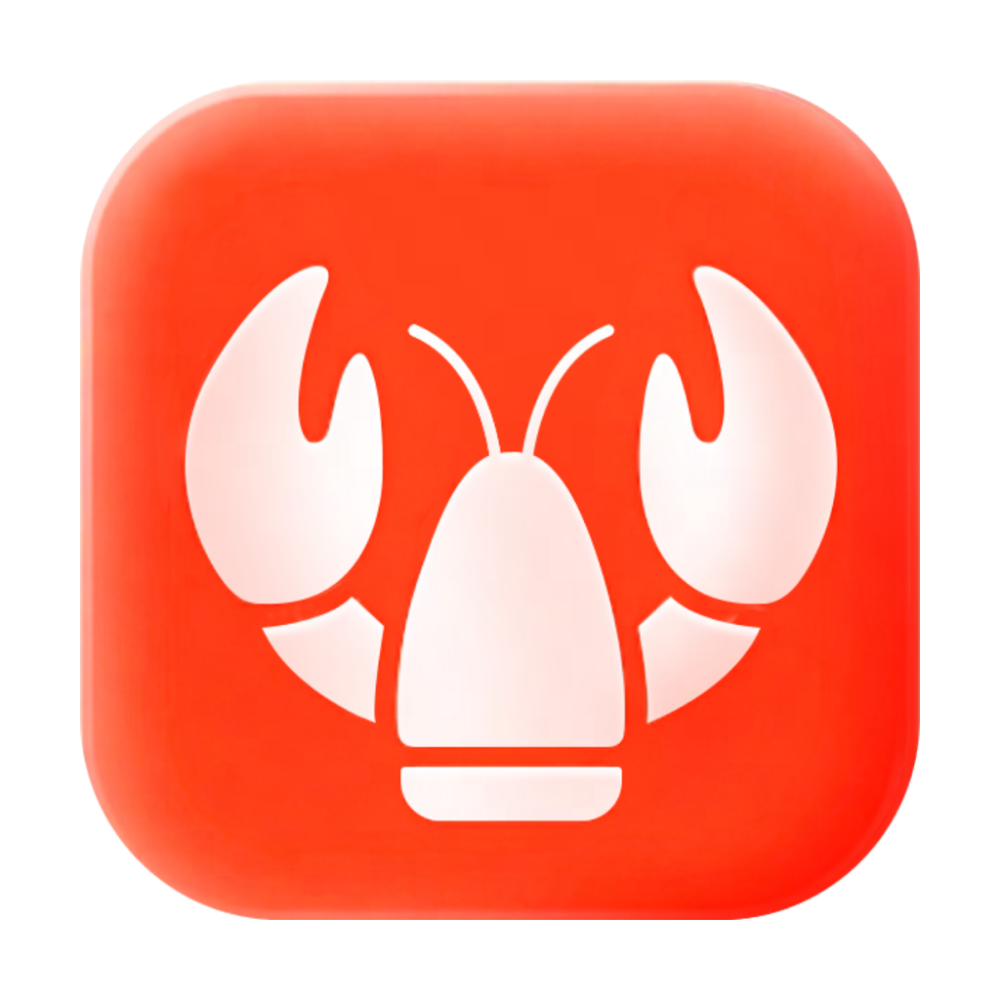

# LobsterAI — AI-Powered Local Assistant

<p align="center">
  
</p>

<p align="center">
  <strong>A local AI assistant that gets things done, powered by Claude Agent SDK</strong>
</p>

<p align="center">
  <a href="LICENSE"></a>
  <br>
  
  <br>
  
  
  
</p>

---

**LobsterAI** is a local AI assistant that runs on your machine. It uses the Claude Agent SDK to execute tools, manipulate files, and run commands — all under your supervision through a web interface.

## Key Features

- **Local Execution** — Run tasks directly on your machine with full control and transparency
- **Web Interface** — Access through any modern web browser at `localhost:3001`
- **Built-in Skills** — Office document generation, web search, Playwright automation, and more
- **Scheduled Tasks** — Create recurring tasks via conversation or the GUI
- **Persistent Memory** — Automatically extracts user preferences and remembers across sessions
- **Permission Gating** — All tool invocations require explicit user approval before execution
- **File Browser** — Browse and manage workspace files directly from the web UI
- **Local Data** — SQLite storage keeps your chat history and configuration on your device

## Quick Start

### Prerequisites

- **Node.js** >= 20
- **pnpm**

### Installation

```bash
# Install globally via pnpm
pnpm install -g lobsterai

# Or use npx without installing
npx lobsterai
```

### Usage

Start the LobsterAI server:

```bash
lobsterai [options]
```

**Options:**

| Option | Description | Default |
|--------|-------------|---------|
| `-p, --port <number>` | Port to run server on | `3001` |
| `--host <string>` | Host to bind to | `localhost` |
| `--no-open` | Don't open browser automatically | - |
| `--data-dir <path>` | Custom data directory | `~/.lobsterai` |
| `--workspace <path>` | Workspace directory | User home |

**Examples:**

```bash
# Start with default settings (opens browser automatically)
lobsterai

# Start on custom port
lobsterai -p 8080

# Start without opening browser
lobsterai --no-open

# Start with custom workspace
lobsterai --workspace ~/my-project
```

### Development from Source

```bash
# Clone the repository
git clone https://github.com/sixtycat2000-ctrl/LobsterAI-Web.git
cd LobsterAI-Web

# Install dependencies
pnpm install

# Build the web UI
pnpm run build:web

# Build the server
pnpm run build:server

# Run the server
pnpm start

# Or run in development mode
pnpm run server:dev
```

## Architecture

LobsterAI uses a simple client-server architecture:

```
┌─────────────────┐   HTTP/WS    ┌──────────────────┐
│   Browser       │ <──────────> │   Express Server │
│   (React UI)    │              │   (Node.js)      │
│                 │              │                  │
│  - Chat View    │              │  - Claude Agent  │
│  - File Browser │              │  - SQLite Store  │
│  - Artifacts    │              │  - File Watcher  │
└─────────────────┘              └──────────────────┘
                                        │
                                        ▼
                                 ┌──────────────┐
                                 │  Workspace   │
                                 │  (Files)     │
                                 └──────────────┘
```

### Directory Structure

```
server/
├── src/
│   ├── cli.ts              # CLI entry point
│   ├── index.ts            # Express server
│   └── fileWatcher.ts      # File change notifications
├── routes/
│   ├── cowork.ts           # Cowork session API
│   ├── files.ts            # File browser API
│   ├── skills.ts           # Skills management
│   ├── store.ts            # Key-value store
│   └── ...
├── public/                 # Built web UI
└── package.json

src/
├── main/                   # Shared business logic
│   ├── libs/
│   │   ├── coworkRunner.ts        # Claude Agent SDK executor
│   │   ├── coworkMemoryExtractor.ts
│   │   └── ...
│   └── ...
├── renderer/               # React web UI
│   ├── components/
│   ├── services/
│   └── store/
└── web/
    └── main.tsx            # Web entry point

SKILLs/                     # Skill definitions
├── skills.config.json
├── web-search/
├── docx/
├── xlsx/
└── ...
```

## Cowork System

Cowork is the core feature — an AI working session system built on the Claude Agent SDK. It can autonomously complete complex tasks like data analysis, document generation, and information retrieval.

### Stream Events

Real-time updates via WebSocket:

- `message` — New message added to the session
- `messageUpdate` — Incremental streaming content update
- `permissionRequest` — Tool execution requires user approval
- `complete` — Session execution finished
- `error` — Execution error occurred
- `file:changed` — File changed in workspace

### Permission Control

All tool invocations involving file system access, terminal commands, or network requests require explicit user approval. Both single-use and session-level approvals are supported.

## Skills System

LobsterAI ships with built-in skills covering productivity, creative, and automation scenarios:

| Skill | Function | Typical Use Case |
|-------|----------|-----------------|
| web-search | Web search | Information retrieval, research |
| docx | Word document generation | Reports, proposals |
| xlsx | Excel spreadsheet generation | Data analysis, dashboards |
| pptx | PowerPoint creation | Presentations |
| pdf | PDF processing | Document parsing |
| playwright | Web automation | Browser tasks |
| local-tools | Local system tools | File management |

## Scheduled Tasks

Create recurring tasks that automatically execute on a schedule:

- **Conversational** — Tell the Agent in natural language
- **GUI** — Add tasks manually in the Scheduled Tasks panel

Typical scenarios: daily news digests, periodic reports, data monitoring.

## Persistent Memory

The system automatically extracts and remembers your personal information and preferences:

- **Automatic Extraction** — Identifies preferences, personal facts during conversations
- **Explicit Requests** — "Remember that I prefer Markdown format"
- **Manual Management** — Edit memories in the Settings panel

## Data Storage

All data is stored in a local SQLite database (`~/.lobsterai/lobsterai.sqlite`):

| Table | Purpose |
|-------|---------|
| `kv` | App configuration |
| `cowork_config` | Cowork settings |
| `cowork_sessions` | Session metadata |
| `cowork_messages` | Message history |
| `scheduled_tasks` | Scheduled tasks |

## Security

- **Permission Gating** — Tool invocations require explicit approval
- **Workspace Boundaries** — File operations restricted to workspace
- **Path Validation** — All file paths validated to prevent traversal attacks
- **Local Only** — By default binds to localhost only

## Tech Stack

| Layer | Technology |
|-------|-----------|
| Server | Express.js + WebSocket |
| Frontend | React 18 + TypeScript |
| Build | Vite 5 |
| Styling | Tailwind CSS 3 |
| State | Redux Toolkit |
| AI Engine | Claude Agent SDK (Anthropic) |
| Storage | sql.js (SQLite WASM) |
| Markdown | react-markdown + remark-gfm + rehype-katex |

## Development

```bash
# Install dependencies
pnpm install

# Development server (hot reload)
pnpm run dev

# Build for production
pnpm run build

# Run tests
pnpm test

# Lint code
pnpm run lint
```

## Contributing

1. Fork this repository
2. Create your feature branch (`git checkout -b feature/your-feature`)
3. Commit your changes (`git commit -m 'feat: add something'`)
4. Push to the branch (`git push origin feature/your-feature`)
5. Open a Pull Request

## License

[MIT License](LICENSE)

---

Built with Claude Agent SDK.
